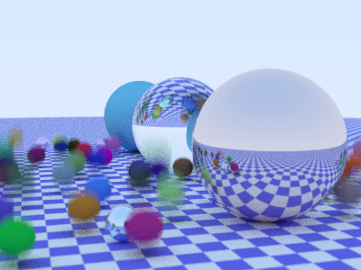
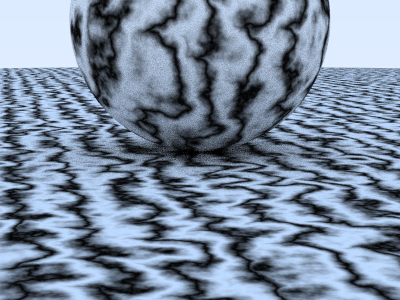
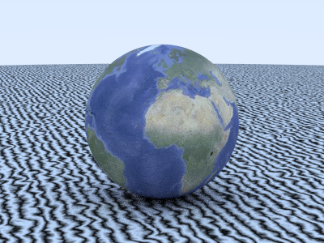
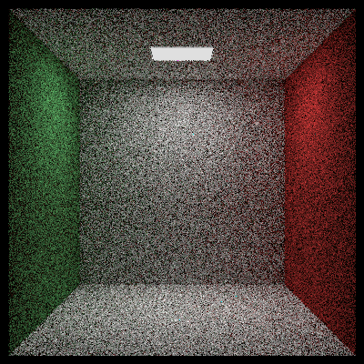
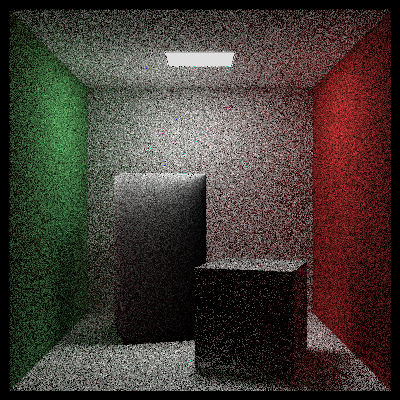

# rust-RTOW
Ray Tracing -The Next Week- written in Rust

# Output Example
### Ch1: Motion Blur

### Ch3: Texture

### Ch4: Perlin Noise

### Ch5: Image Texture

### Ch6: Cornell Box

### Ch7: Instances

